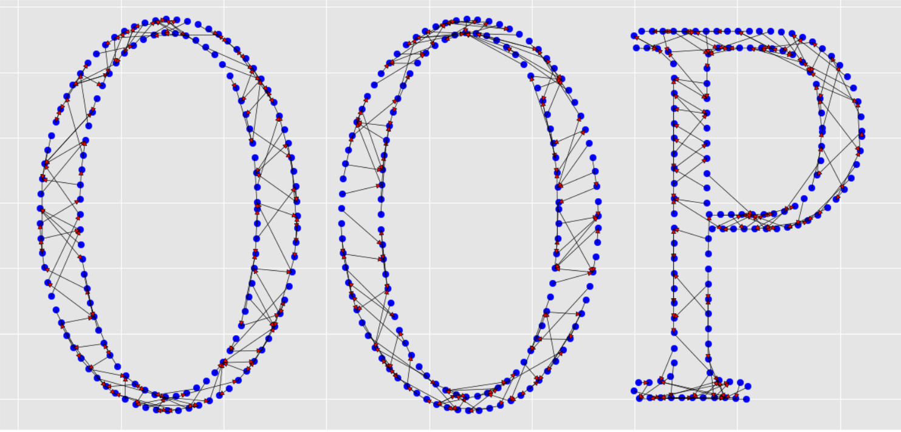
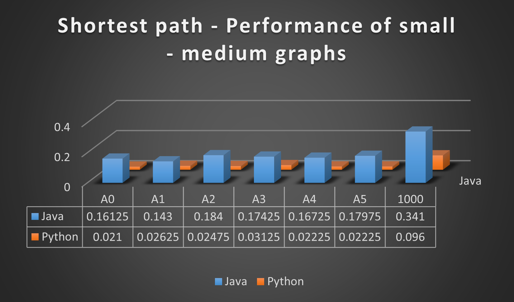
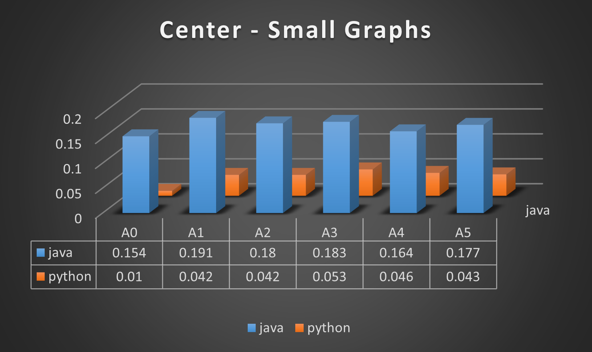
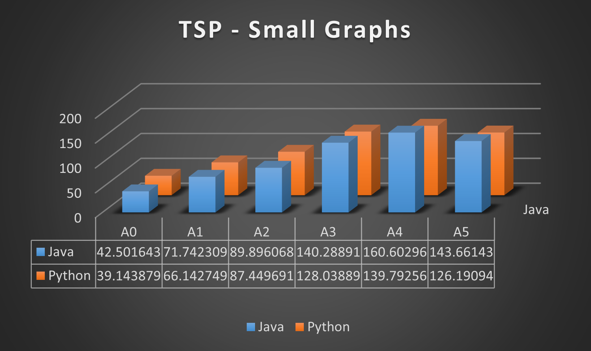

<p align="center">
    
</p>

# Assignment 3

Assignment 3 for the course Object-Oriented Programming written and programmed by Ofri Tavor and Nir Sasson.

## Overview
In this project we were tasked to port from Java our [Assignment 2](https://github.com/SassonNir/OOP-Ex2) where we were given an API defined using interfaces to implement all the interfaces.

## Getting started

### Clone the repositorty
Enter your IDE and clone the repository:

```sh
git clone https://github.com/Unusual55/OOP-Ex3.git
```

### Prerequisites

Enter the terminal in your IDE and install the next commands in order to install the required modules:

```git
pip install -r requirements.txt
```

### Usage

In order to run the program enter the following in your terminal:

```sh
cd path/to/src/folder
python main.py
```

Note that the `cd` is important since the main uses relative paths.  

In order to run the GUI enter the following in your terminal:

```sh
python path/to/Gui/folder/GuiPanel.py 
```

## Documentation

For more information and details about the structure and background of the project please refer to the [Wiki Pages](../../wiki).

## Comparison and Stats

### Shortest Path



### Centre



### TSP



### Results

